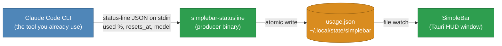

# SimpleBar

**A usage monitor for Claude Code: see how much of your 5-hour session limit is
left, at a glance.** A macOS HUD that turns the number Claude Code already
knows into a circular gauge, draining as you use it.

SimpleBar is not a standalone tool — it a partner to Claude Code. Claude Code
already knows your remaining session limit and can hand it to a status-line
command; SimpleBar takes that same number and expands it into a macOS HUD, a
circular gauge that drains as you use it and can be pinned above your editor.
The number is account-wide: it already includes claude.ai and mobile usage, not
just this machine.


> **Scope: terminal Claude Code only.** SimpleBar reads the Claude Code
> status-line feature, which exists only where Claude Code draws a terminal
> interface. So it updates from **any terminal** — Terminal, iTerm, tmux, and
> VS Code's *integrated terminal*. It does **not** update from the GUI
> surfaces: the Claude desktop app, VS Code's Claude *panel*, the web, or
> mobile. Those read the same settings file but never run a status-line
> command, because a GUI has no status line to draw. Tested directly,
> 2026-08-05 — see `DESIGN.md`.
>
> You only wire it once: every local surface shares `~/.claude/settings.json`,
> so a single click connects every terminal you use.

## ⚠️ macOS will refuse to open this the first time. Sorry.

**Expect this, it is not a virus and nothing is broken:**

> **macOS will block SimpleBar from opening, saying Apple cannot check or
> verify it for malicious software.**

The exact wording varies by macOS version, but it always amounts to the same
thing: Apple has not vetted this app, so your Mac will not run it until you
say so.

Every Mac app has to be signed and notarized by Apple to open without this, and
that requires an Apple Developer account at **$99 a year**. This is a free
hobby project and nobody is paying that fee, so the app ships unsigned and
macOS treats it with suspicion.

**Getting past it, once:**

1. Try to open SimpleBar. Let it be refused.
2. Open **System Settings → Privacy & Security**.
3. Scroll down to the message about SimpleBar being blocked, and click
   **Open Anyway**.
4. Confirm. Every launch after this is normal.

The source is all here if you would rather read it than trust it — or build it
yourself, which sidesteps the warning entirely.

## How it fits together



Claude Code invokes the producer as its `statusLine` command and pipes it the
numbers it already has (`rate_limits.five_hour.used_percentage`, `resets_at`)
on stdin. The producer writes them to a file; the HUD watches that file. **No
credentials, no network calls** — SimpleBar never talks to any API. See
`DESIGN.md` for the full reasoning, including why the OAuth-endpoint alternative
was deliberately deferred.

The window is ~95% transparent, so it reads over whatever is behind it — here
the Claude Code session shows through the gauge. The two controls under the
reading mute the alert beeps and pin the window on top.


## Status

**Everything built and working.** The wheel drains, changes colour at 20% and
10%, and follows the reading live while Claude Code runs. It sounds an alert on
each threshold crossing, with a mute toggle; shows distinct no-data and stale
states rather than pretending an old number is current; remembers its size and
position; and pins above other windows on demand.

The app installs itself: the `.app` carries the producer inside it, and a
**Connect to Claude Code** button copies it out and registers it, so using
SimpleBar needs neither a terminal nor a checkout. The download is a universal
binary — one file, native on both Apple Silicon and Intel — and is unsigned,
which is why the warning above exists.

See `DESIGN.md` for the milestone history, including M5, an
adjustable-translucency menu, dropped by decision.

## Install

Nothing to install alongside it — no Rust, no Node. Those are needed to *build*
SimpleBar, not to run it; the download carries finished binaries.

1. Download the `.dmg` from the
   [latest release](https://github.com/daniel-p-allen/SimpleBar/releases/latest).
   One download for every Mac — it is a universal binary, so it runs natively on
   both Apple Silicon and Intel, and there is nothing to choose between.
2. Open the DMG and drag **SimpleBar** to Applications.
3. Open it. **macOS will refuse the first time** — see below.
4. Click **Connect to Claude Code** in the window. That copies the producer to
   `~/.local/bin/` and points `~/.claude/settings.json` at it, backing up any
   existing settings first. The button disappears once it has worked.
5. Use Claude Code. Each status-line render updates the gauge; the window shows
   "no data yet" until the first one arrives.

### The first-launch warning

See [the warning above](#️-macos-will-refuse-to-open-this-the-first-time-sorry) —
step 3 is where it happens. One trip to System Settings → Privacy & Security,
then never again.

## Building it yourself

Not needed to use SimpleBar — this is the developer path.

Requirements:

- **macOS.** Stage 1 is macOS only.
- **Rust** — install via [rustup](https://rust-lang.org/tools/install/)
  ([other methods](https://forge.rust-lang.org/infra/other-installation-methods.html#which)).
- **Node.js** (18 or newer) for the Tauri CLI.
- **Xcode Command Line Tools** — Tauri builds the window against them. If you
  don't have them: `xcode-select --install`.

Then:

1. `git clone https://github.com/daniel-p-allen/SimpleBar.git`
2. `cd SimpleBar`
3. `make build` — builds the producer, the installer, and an unsigned
   `SimpleBar.app` (a few minutes the first time).
4. `make install-statusline` — wires the producer into
   `~/.claude/settings.json`, backing the file up first. This points the status
   line at the binary in your checkout, so it is the right choice while working
   on the code and the wrong one if you later move or delete the clone.
5. `make run` — opens the app window.

A checkout wired this way is recognised as already connected, so the Connect
button stays hidden.

## Developing

Run against source without producing a bundle:

```sh
cargo build --manifest-path statusline/Cargo.toml   # the producer
npm install && npx tauri dev                         # the window
```

Check your work:

```sh
make test    # both test suites
make check   # refuse to ship a committed credential
```

Feed the producer a status-line blob by hand:

```sh
cat tests/fixtures/full.json | statusline/target/debug/simplebar-statusline
# 35% left · resets 1:00 am
```

## Wiring it by hand

The Connect button is the easy path, and `make install-statusline` the
developer's. To do it yourself, add to `~/.claude/settings.json` (back up
first), pointing at your release binary:

```json
"statusLine": {
  "type": "command",
  "command": "/path/to/SimpleBar/statusline/target/release/simplebar-statusline"
}
```

**On Windows, use forward slashes in that path** (`C:/Users/you/...`, not
`C:\Users\you\...`). Claude Code routes status-line commands through Git Bash
when it's installed, and Git Bash consumes unquoted backslashes as escape
characters — the command fails silently and the status line just stays blank,
with no error anywhere. This isn't SimpleBar-specific; it hits any hand-edited
`command` path in `settings.json`.

The reading is written to `$XDG_STATE_HOME/simplebar/usage.json` (default
`~/.local/state/simplebar/`), per the XDG Base Directory Specification.

## Common questions

**How do I see how much Claude usage I have left?**
Claude Code already knows — it receives your remaining 5-hour session limit and
can pass it to a status-line command. SimpleBar registers itself as that
command and draws the number as a gauge you can leave on screen.

**Does this show usage from claude.ai and the mobile app too?**
Yes. The figure Claude Code reports is account-wide, so browser and phone usage
are already included. It only *refreshes* while a Claude Code session is
running, which is why the gauge greys out and says so when the reading is old
rather than showing a stale number as if it were current.

**Does it need my API key?**
No. SimpleBar makes no network calls and handles no credentials. It reads a
local file that Claude Code's status line writes, and nothing leaves your
machine.

**Does it work with the Claude desktop app, or VS Code's Claude panel?**
No — terminal sessions only, including VS Code's integrated terminal. A status
line is a terminal feature, so the GUI surfaces never invoke it. Measured, not
assumed: see `DESIGN.md`.

**Is it a menu bar app?**
No. It is a resizable window you can pin above your editor. A menu bar item
cannot draw a gauge, play a sound, or be alt-tabbed to.

**Does it cost anything, or send telemetry?**
No to both. MIT licensed, no analytics, no accounts.

## Layout

```
statusline/    Rust — the simplebar-statusline producer, and its tests
src-tauri/     Rust — window, file watching
src/           webview UI — HTML/CSS/SVG, the wheel
scripts/       repo tooling (check-secrets.sh)
tests/         shared fixtures, and the consumer's tests
```

## License

MIT — see `LICENSE`.
