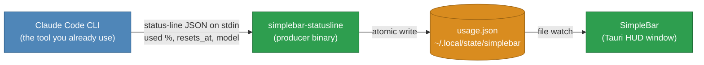

# SimpleBar

**A companion app for Claude Code that turns your usage into a visual you can
glance at.** See how much of your Claude 5-hour session limit is left, without
asking.

SimpleBar is not a standalone tool — it a partner to Claude Code. Claude Code
already knows your remaining session limit and can hand it to a status-line
command; SimpleBar takes that same number and expands it into a macOS HUD, a
circular gauge that drains as you use it and can be pinned above your editor.
The number is account-wide: it already includes claude.ai and mobile usage, not
just this machine.

> **Scope: Claude Code CLI, for now.** SimpleBar currently reads from the Claude
> Code command-line tool's status-line feature. Support for other Claude
> surfaces is planned for later — see `DESIGN.md`.

## How it fits together



Claude Code invokes the producer as its `statusLine` command and pipes it the
numbers it already has (`rate_limits.five_hour.used_percentage`, `resets_at`)
on stdin. The producer writes them to a file; the HUD watches that file. **No
credentials, no network calls** — SimpleBar never talks to any API. See
`DESIGN.md` for the full reasoning, including why the OAuth-endpoint alternative
was deliberately deferred.

## Status

**M1–M4, M6, M7 and M9 built.** The producer, window, file watch and wheel
work: the wheel drains, changes colour at 20% and 10%, and follows the reading
live while Claude Code runs. It beeps once on each threshold crossing with a
mute toggle (M6), shows no-data and stale states (M7), and remembers its size
and position across restarts (M9). Packaging (M8) builds an unsigned local
`.app` and wires the producer in via `make install-statusline`. A pin toggle
floats the window above other apps. See `DESIGN.md` for the full milestone
list — including M5, an adjustable-translucency menu, dropped by decision.

## Requirements

- **macOS.** Stage 1 is macOS only.
- **Rust** — install via [rustup](https://rust-lang.org/tools/install/)
  ([other methods](https://forge.rust-lang.org/infra/other-installation-methods.html#which)).
- **Node.js** (18 or newer) for the Tauri CLI.
- **Xcode Command Line Tools** — Tauri builds the window against them. If you
  don't have them: `xcode-select --install`.

## Quick start

With the requirements above in place:

1. `git clone https://github.com/daniel-p-allen/SimpleBar.git`
2. `cd SimpleBar`
3. `make build` — builds the producer, the installer, and an unsigned
   `SimpleBar.app` (a few minutes the first time).
4. `make install-statusline` — wires the producer into
   `~/.claude/settings.json`, backing the file up first.
5. `make run` — opens the app window.
6. Use Claude Code. Each status-line render updates the gauge; the window shows
   "no data yet" until the first one arrives.

The app is **unsigned** — there's no Apple Developer account behind this build,
so you run your own local build rather than a downloaded, double-clickable app.

## Developing

Run against source without producing a bundle:

```sh
cargo build --manifest-path statusline/Cargo.toml   # the producer
npm install && npx tauri dev                         # the window
```

Check your work:

```sh
make test    # both test suites
make check   # refuse to ship a committed credential
```

Feed the producer a status-line blob by hand:

```sh
cat tests/fixtures/full.json | statusline/target/debug/simplebar-statusline
# 35% left · resets 1:00 am
```

## Wiring it by hand

`make install-statusline` is the easy path. To do it yourself, add to
`~/.claude/settings.json` (back up first), pointing at your release binary:

```json
"statusLine": {
  "type": "command",
  "command": "/path/to/SimpleBar/statusline/target/release/simplebar-statusline"
}
```

The reading is written to `$XDG_STATE_HOME/simplebar/usage.json` (default
`~/.local/state/simplebar/`), per the XDG Base Directory Specification.

## Layout

```
statusline/    Rust — the simplebar-statusline producer, and its tests
src-tauri/     Rust — window, file watching
src/           webview UI — HTML/CSS/SVG, the wheel
scripts/       repo tooling (check-secrets.sh)
tests/         shared fixtures, and the consumer's tests
```

## License

MIT — see `LICENSE`.
