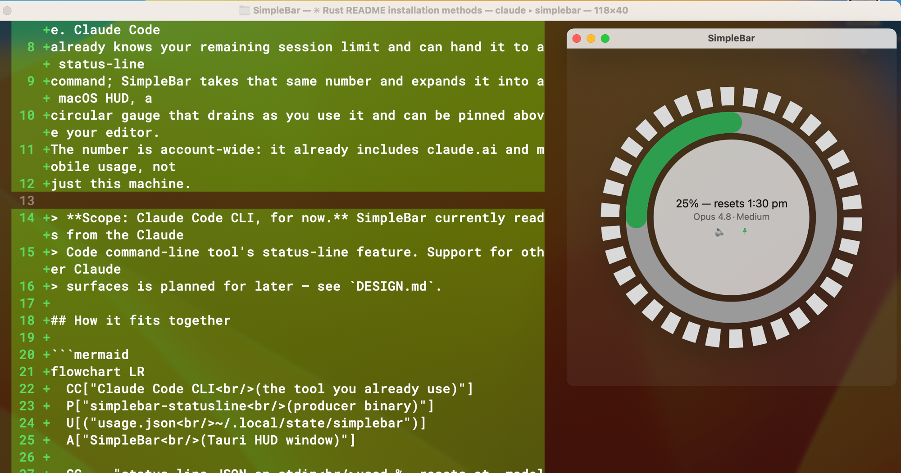
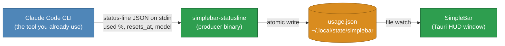
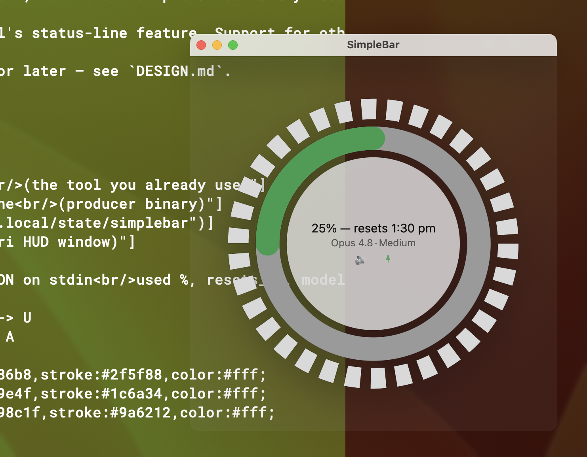

# SimpleBar

**A companion app for Claude Code that turns your usage into a visual you can
glance at.** See how much of your Claude 5-hour session limit is left, without
asking.

SimpleBar is not a standalone tool — it a partner to Claude Code. Claude Code
already knows your remaining session limit and can hand it to a status-line
command; SimpleBar takes that same number and expands it into a macOS HUD, a
circular gauge that drains as you use it and can be pinned above your editor.
The number is account-wide: it already includes claude.ai and mobile usage, not
just this machine.



> **Scope: Claude Code CLI, for now.** SimpleBar currently reads from the Claude
> Code command-line tool's status-line feature. Support for other Claude
> surfaces is planned for later — see `DESIGN.md`.

## ⚠️ macOS will refuse to open this the first time. Sorry.

**Expect this, it is not a virus and nothing is broken:**

> **"SimpleBar" cannot be opened because Apple cannot check it for malicious
> software.**
>
> or, on newer macOS:
>
> **"SimpleBar" Not Opened — Apple could not verify "SimpleBar" is free of
> malware that may harm your Mac or compromise your privacy.**

Every Mac app has to be signed and notarized by Apple to open without this, and
that requires an Apple Developer account at **$99 a year**. This is a free
hobby project and nobody is paying that fee, so the app ships unsigned and
macOS treats it with suspicion.

**Getting past it, once:**

1. Try to open SimpleBar. Let it be refused.
2. Open **System Settings → Privacy & Security**.
3. Scroll down to the message about SimpleBar being blocked, and click
   **Open Anyway**.
4. Confirm. Every launch after this is normal.

The source is all here if you would rather read it than trust it — or build it
yourself, which sidesteps the warning entirely.

## How it fits together



Claude Code invokes the producer as its `statusLine` command and pipes it the
numbers it already has (`rate_limits.five_hour.used_percentage`, `resets_at`)
on stdin. The producer writes them to a file; the HUD watches that file. **No
credentials, no network calls** — SimpleBar never talks to any API. See
`DESIGN.md` for the full reasoning, including why the OAuth-endpoint alternative
was deliberately deferred.

The window is ~95% transparent, so it reads over whatever is behind it — here
the Claude Code session shows through the gauge. The two controls under the
reading mute the alert beeps and pin the window on top.



## Status

**M1–M4, M6, M7 and M9 built.** The producer, window, file watch and wheel
work: the wheel drains, changes colour at 20% and 10%, and follows the reading
live while Claude Code runs. It beeps once on each threshold crossing with a
mute toggle (M6), shows no-data and stale states (M7), and remembers its size
and position across restarts (M9). Packaging (M8) builds an unsigned local
`.app` and wires the producer in via `make install-statusline`. A pin toggle
floats the window above other apps. See `DESIGN.md` for the full milestone
list — including M5, an adjustable-translucency menu, dropped by decision.

The app now installs itself: the `.app` carries the producer inside it, and a
**Connect to Claude Code** button copies it to `~/.local/bin/` and registers it,
so using SimpleBar no longer needs a terminal or a checkout.

## Install

Nothing to install alongside it — no Rust, no Node. Those are needed to *build*
SimpleBar, not to run it; the download carries finished binaries.

1. Download `SimpleBar_0.1.0_x64.dmg` from the
   [latest release](https://github.com/daniel-p-allen/SimpleBar/releases/latest).
2. Open the DMG and drag **SimpleBar** to Applications.
3. Open it. **macOS will refuse the first time** — see below.
4. Click **Connect to Claude Code** in the window. That copies the producer to
   `~/.local/bin/` and points `~/.claude/settings.json` at it, backing up any
   existing settings first. The button disappears once it has worked.
5. Use Claude Code. Each status-line render updates the gauge; the window shows
   "no data yet" until the first one arrives.

### The first-launch warning

See [the warning above](#️-macos-will-refuse-to-open-this-the-first-time-sorry) —
step 3 is where it happens. One trip to System Settings → Privacy & Security,
then never again.

## Building it yourself

Not needed to use SimpleBar — this is the developer path.

Requirements:

- **macOS.** Stage 1 is macOS only.
- **Rust** — install via [rustup](https://rust-lang.org/tools/install/)
  ([other methods](https://forge.rust-lang.org/infra/other-installation-methods.html#which)).
- **Node.js** (18 or newer) for the Tauri CLI.
- **Xcode Command Line Tools** — Tauri builds the window against them. If you
  don't have them: `xcode-select --install`.

Then:

1. `git clone https://github.com/daniel-p-allen/SimpleBar.git`
2. `cd SimpleBar`
3. `make build` — builds the producer, the installer, and an unsigned
   `SimpleBar.app` (a few minutes the first time).
4. `make install-statusline` — wires the producer into
   `~/.claude/settings.json`, backing the file up first. This points the status
   line at the binary in your checkout, so it is the right choice while working
   on the code and the wrong one if you later move or delete the clone.
5. `make run` — opens the app window.

A checkout wired this way is recognised as already connected, so the Connect
button stays hidden.

## Developing

Run against source without producing a bundle:

```sh
cargo build --manifest-path statusline/Cargo.toml   # the producer
npm install && npx tauri dev                         # the window
```

Check your work:

```sh
make test    # both test suites
make check   # refuse to ship a committed credential
```

Feed the producer a status-line blob by hand:

```sh
cat tests/fixtures/full.json | statusline/target/debug/simplebar-statusline
# 35% left · resets 1:00 am
```

## Wiring it by hand

The Connect button is the easy path, and `make install-statusline` the
developer's. To do it yourself, add to `~/.claude/settings.json` (back up
first), pointing at your release binary:

```json
"statusLine": {
  "type": "command",
  "command": "/path/to/SimpleBar/statusline/target/release/simplebar-statusline"
}
```

The reading is written to `$XDG_STATE_HOME/simplebar/usage.json` (default
`~/.local/state/simplebar/`), per the XDG Base Directory Specification.

## Layout

```
statusline/    Rust — the simplebar-statusline producer, and its tests
src-tauri/     Rust — window, file watching
src/           webview UI — HTML/CSS/SVG, the wheel
scripts/       repo tooling (check-secrets.sh)
tests/         shared fixtures, and the consumer's tests
```

## License

MIT — see `LICENSE`.
